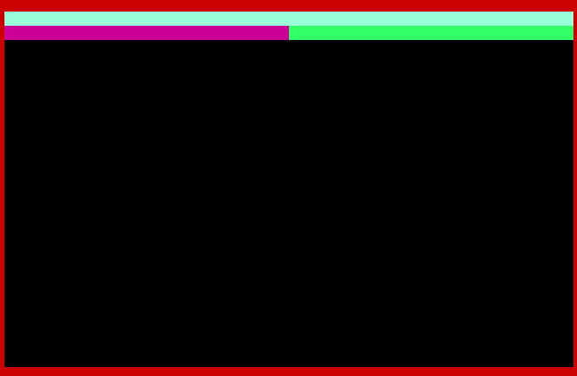
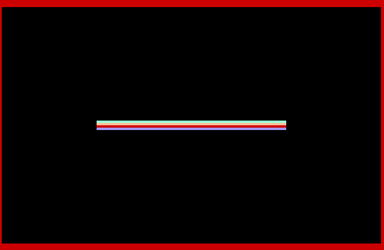
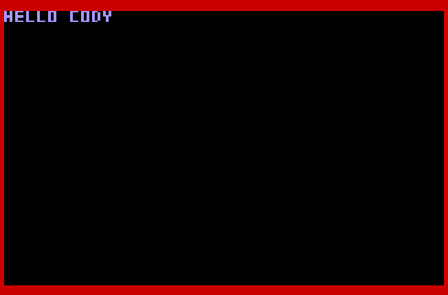
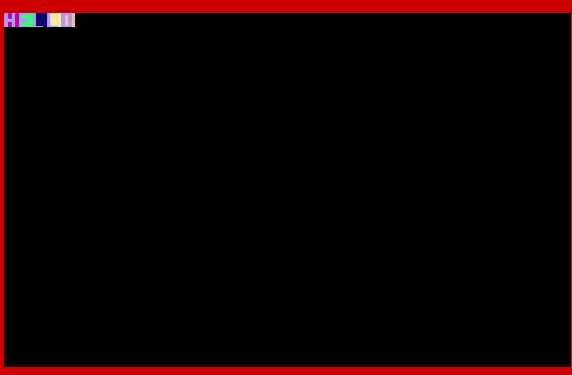
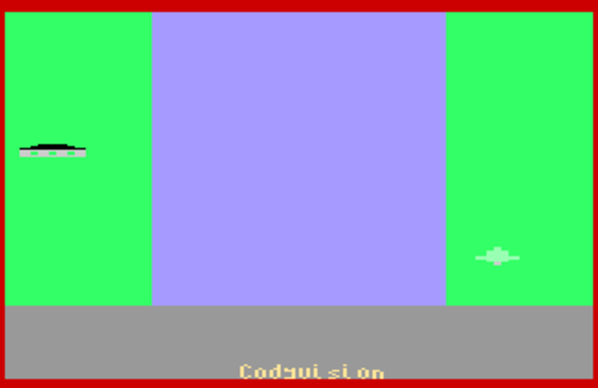
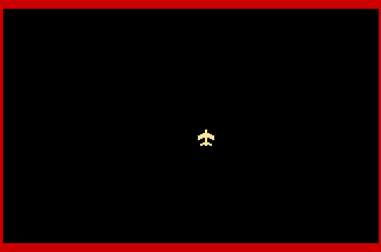
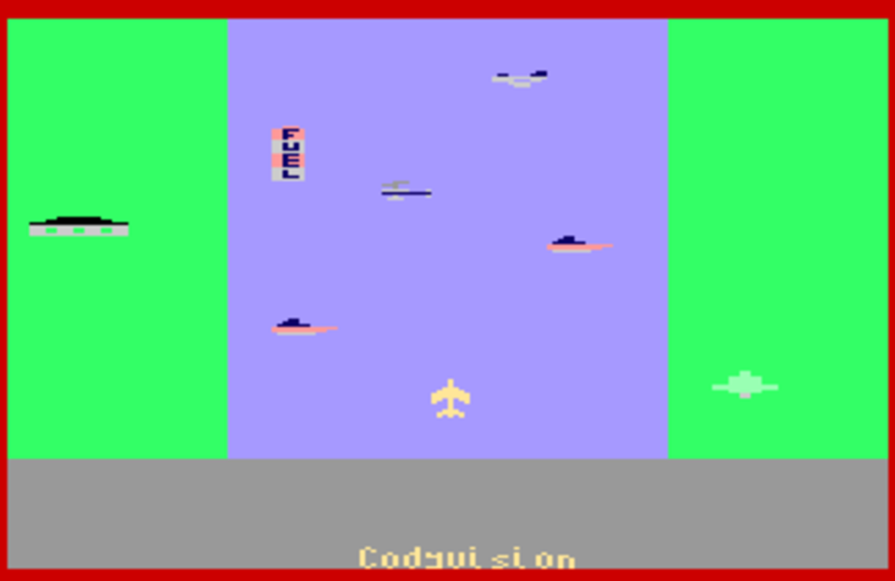
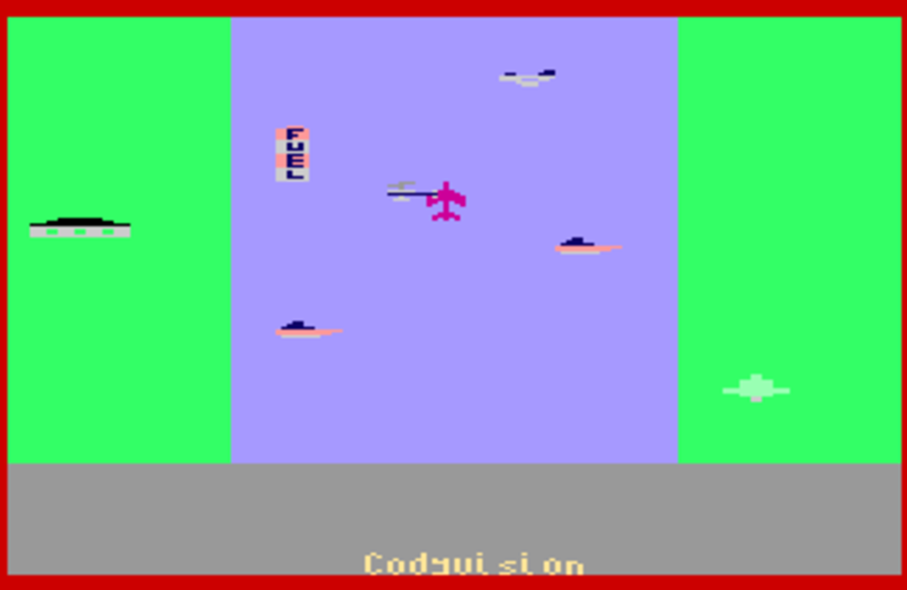

# Cody 65c02 Assembly Tutorial

# Workflow

Review the Assembly example code along with the comments in each file, then complete the exercise.

# Assemble and Run 

`64tass --mw65c02 --nostart -o 01_bordercolor.bin 01_bordercolor.asm` 

`cargo run --release -- --as-cartridge ../cody-games/65c02Assembly/DemoCode/01_bordercolor.bin` 

# 01 Border Color
- Book: Page 309 "CHANGING THE BORDER COLOR"
- Example: sets border color to red [01_bordercolor.asm](./code/01/01_bordercolor.asm)
- Exercise: change the color to blue [01_solution.asm](./code/01/01_solution.asm)

# 02 Tile Color
- Book: Page 314 "UPDATING COLOR MEMORY"
- Example: change 40 tile colors to cyan [02_tilecolor.asm](./code/02/02_tilecolor.asm)
- Exercise: draw 20 purple and 20 green tile below the cyan tiles [02_solution.asm](./code/02/02_solution.asm)

# 03 Tile Data
- Example: changes 20 tiles in the first row [03_tiledata.asm](./code/03/03_tiledata.asm)
- Exercise: draw 20 tiles of type one in the middel row of the screen by starting at tile 490 [03_solution.asm](./code/03/03_solution.asm)

# 04 Text 
- Example: prints the text "HELLO" [04_hello.asm](./code/04/04_hello.asm)
- Exercise: print the text "HELLO CODY" [04_solution.asm](./code/04/04_solution.asm)

# 05 Key Input
- Book: Page 65 "KEYBOARD" and page 387 "KEYBOARD AND JOYSTICK INPUT"
- Example: prints the text "HELLO" after the P Key has been pressed [05_pressP.asm](./code/05/05_pressP.asm)
- Exercise: Change the bg color of the text after the C Key has been pressed [05_solution.asm](./code/05/05_solution.asm)

# 06 Draw Level

Hint: use the Python scripts in https://github.com/JonnyWalker/cody-games/tree/main/Tools/CodyBASIC to convert images to tile data or sprite data.

E.g `python image_to_bytes.py -s sprites/Jet.bmp -l tass`

- Example: draws a level (river and land) by changing tile colors [06_level.asm](./code/06/06_level.asm)
- Exercise: add a gray status bar at the bottom (last five rows) and write the text "Codyvision" [06_solution.asm](./code/06/06_solution.asm)

# 07 Draw Sprite

Hint: use the Python scripts in https://github.com/JonnyWalker/cody-games/tree/main/Tools/CodyBASIC to convert images to tile data or sprite data.

E.g `python image_to_bytes.py -s sprites/Jet.bmp -l tass`
- Book: Page 327 "MOVING GRAPHICS WITH SPRITES"
- Example: draws a jet sprite [07_sprite.asm](./code/07/07_sprite.asm)
- Exercise: draw the sprite in the middle of the screen [07_solution.asm](./code/07/07_solution.asm)

# 08 Move Sprite
- Example: moves a jet sprite using the joystick up/down/left/right, (arrow keys in emulation) [08_move_sprite.asm](code/08/08_move_sprite.asm)
- Exercise: use WASD keys to move the sprite [08_solution.asm](code/08/08_solution.asm)

Hint: use `CMP`

# 09 Level with moving Sprite

Hint: use the Python scripts in https://github.com/JonnyWalker/cody-games/tree/main/Tools/CodyBASIC to convert images to tile data or sprite data.

E.g `python image_to_bytes.py -s sprites/Jet.bmp -l tass`
- Example: combines all examples to a level with a moving sprite [09_level_with_sprite.asm](code/09/09_level_with_sprite.asm)
- Exercise: add more sprite like in the screenshot below [09_solution.asm](code/09/09_solution.asm)

# 10 Collision
- Example: jet turns red after a collision with the fuel sprite [10_collision.asm](code/10/10_collision.asm)
- Exercise: add collision checks for all 5 sprites [10_solution.asm](code/10/10_solution.asm)

